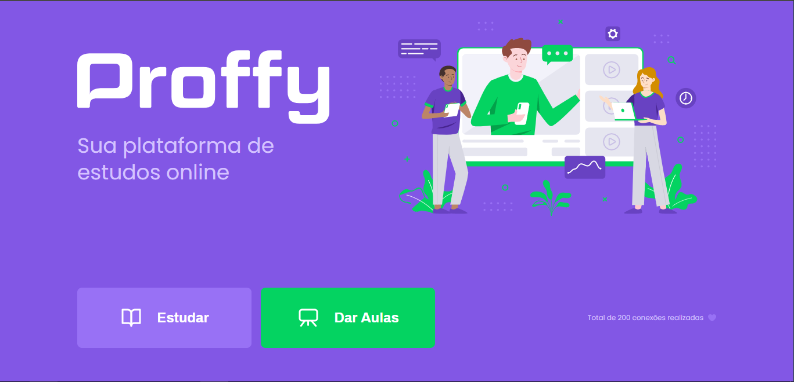
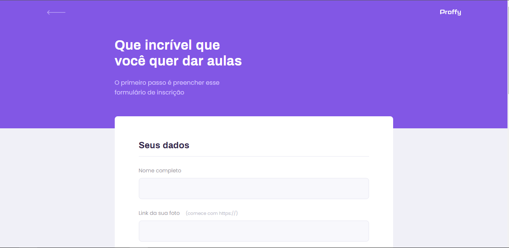
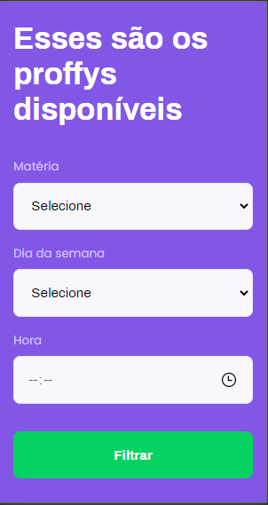
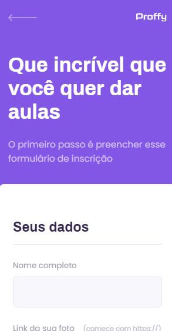

# Bootcamp Next Level Week 2 - Discovery

  

> :rocket: Destinado ao público **iniciante** no mundo do Desenvolvimento Web, o NLW2 Discovery propõe a criação de um projeto de plataforma de estudos online. O Bootcamp foi organizado pela , e ministrado pelo professor .

## :computer: Web Screenshot

    
  

## :iphone: Mobile Screenshot

    
    
    

## :pushpin: Tecnologias usadas
* HTML5
* CCS3
* JavaScript
* NodeJS
* SQLite
  
:bulb: Fique à vontade para fazer issues e colaborar no projeto, estou disposto a avaliar pull requests!

> projeto elaborado em setembro de 2020 por . Mil obrigados à galera da Rocketseat :rocket:
